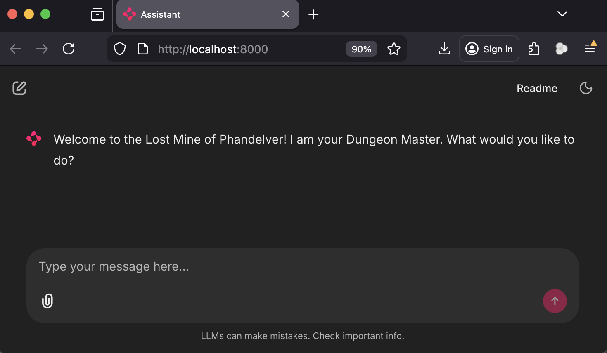
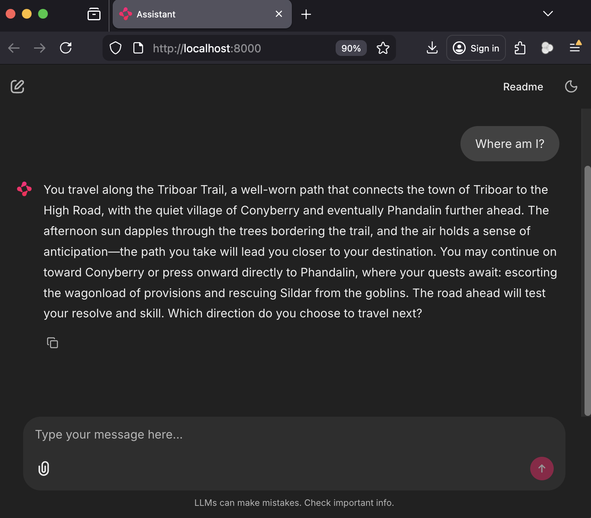

## Installation

Ensure you have Python >=3.10 <3.14 and `uv` installed on your system. This project uses [UV](https://docs.astral.sh/uv/) for dependency management and package handling.

Run `git clone <this_project_url>` to clone this repo on your system. Create a `.env` file in the project's root directory with `OPENAI_API_KEY=<your_openai_api_key_here>`. Install the dependencies outlined in `pyproject.toml` by running `uv sync` from the project's root directory.

## Running the Default Campaign

The default campaign is [The Lost Mines of Phandelver](https://5e.tools/adventure.html#lmop) (LMoP), a classic starting D&D campaign that is good for beginners. To run the system with a different campaign, see the section below (Running a Different Campaign).

To run the default campaign, run `uv run launch_chainlit.py` from the project's root directory. This will use the adventure guide and knowledge graph for LMoP included in this repo. A new browser window for your default browser will open automatically, and should resemble the following:

Enter your questions or actions directly into the text window and hit enter to submit, as if you were speaking to a human DM. For example:

You can scroll up in this window to view the chat history.

Check the `game.log` file to view the system logs.

## Running a Different Campaign

To play a different campaign besides the default (LMoP), first download an adventure guide similar to the LMoP adventure guide as a markdown (`.md`) or text (`.txt`) file. Save this file in `./data`. Next, construct a knowledge graph from this file by running `uv run build_knowledge_graph.py --adventure-guide <path_to_adventure_guide>` where `<path_to_adventure_guide>` points to the file you just downloaded (e.g., `./data/guide.md`). This will save a knowledge graph as a JSON file to `knowledge_graph.json`. Next, run the system with the new campaign by running `uv run launch_chainlit.py --adventure-guide <path_to_adventure_guide> --knowledge-graph <path_to_knowledge_graph>` where `<path_to_adventure_guide>` points to the file you just downloaded (e.g., `./data/guide.md`) and `<path_to_knowledge_graph>` points to the knowledge graph you just created (e.g., `./dnd_system/state/knowledge_graph.json`).

## Troubleshooting

If you encounter any issues, first check the `game.log` file for any errors related to your API key and/or quota limits. Try running the system again using the default campaign (i.e., using "Lost Mine of Phandelver.md" as the adventure guide and "knowledge_graph.json" as the knowledge graph). If issues persist, clone a fresh instance of this repo and try running the system again using the default campaign (i.e., no command line arguments passed to `uv run launch_chainlit.py`).