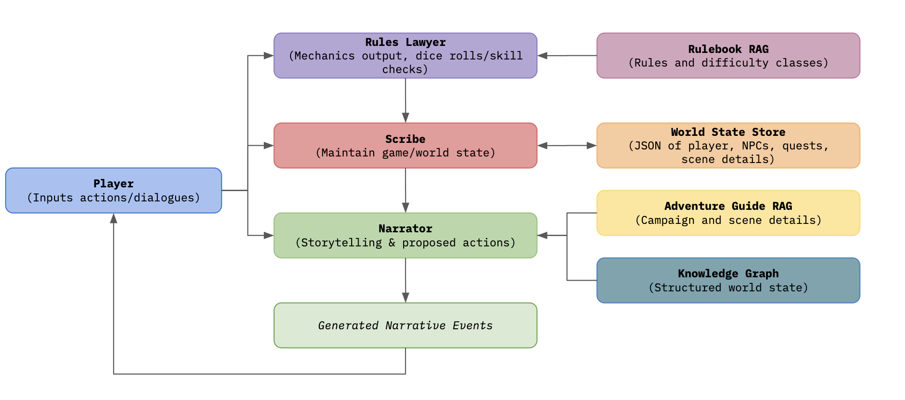
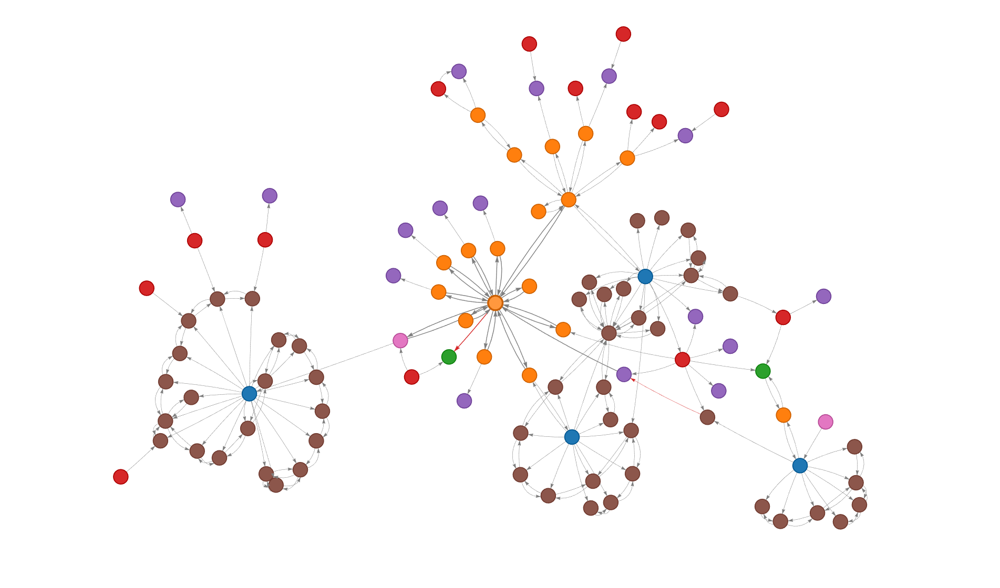

# Agentic DM: A Knowledge Graph-Driven Multi-Agent Framework for TTRPGs

**Agentic DM** is a scalable, AI-driven Dungeon Master framework designed to automate the administrative and creative workload of running *Dungeons & Dragons* (5th Edition) games. By combining a **Knowledge Graph Extraction Pipeline** with a **Multi-Agent Architecture** (CrewAI), the system provides a persistent, rule-compliant, and spatially consistent single-player experience.

*Columbia University COMSE6998 — Introduction to LLM-based Generative AI Systems, Fall 2025*



## Contributors

| Contributor | Responsibilities |
|------------|-----------------|
| **Kuang Sun** | Architected and implemented the core system pipeline: CrewAI multi-agent orchestration, Knowledge Graph extraction pipeline & cross-chapter bridging algorithm, GraphRAG retrieval tools, data ingestion workflow, Chainlit UI, and quantitative evaluation |
| **Ryerson Burdick** | Model selection & testing, prompt engineering & agent behavior refinement, latency optimization, qualitative evaluation, and knowledge graph visualization |

## Motivation

Running a D&D campaign requires a Dungeon Master who simultaneously tracks world state, enforces rules, and improvises narrative — a role that is difficult to fill and impossible to scale. Naive LLM approaches fail in three critical ways:

1. **Spatial hallucination**: An unconstrained LLM will invent rooms and connections that don't exist in the adventure, breaking world consistency
2. **Rule non-compliance**: Without grounding in actual game rules, the LLM might allow impossible feats (e.g., skipping encounters, ignoring damage) simply to follow the player's instructions
3. **State drift**: Over multi-turn sessions, LLMs lose track of HP, inventory, location, and quest progress — the conversation context window is not a substitute for persistent state

Existing approaches (fine-tuning on transcripts, simple conversational memory) address style but not structure. **Agentic DM** solves this with a *data-first* approach: a structured Knowledge Graph as the source of spatial truth, specialized agents with separated concerns, and deterministic JSON state tracking.

## Features
*   **Multi-Agent DM**: Decomposes the DM role into specialized agents:
    *   **Narrator**: Creative storytelling and scene description.
    *   **Rules Lawyer**: Rule adjudication using 5e SRD RAG.
    *   **Scribe**: Deterministic state tracking (HP, Inventory, Quests).
*   **Knowledge Graph Navigation**: Prevents hallucinations by grounding movement in a structured graph extracted from the adventure module.
*   **Persistent State**: Tracks player health, inventory, and location across long game sessions.
*   **Reactive UI**: A web interface (Chainlit) that provides an immersive narrative feed and interactive decision points (e.g., dice rolls).
*   **Any-Adventure Pipeline**: Tools to ingest any standard D&D adventure PDF/Text and convert it into a playable map.

## Installation

### Prerequisites
*   Python >= 3.10
*   An OpenAI API Key (GPT-4o recommended for best performance)

### Setup
1.  **Clone the repository**:
    ```bash
    git clone <repository_url>
    cd agenticdm
    ```

2.  **Environment Variables**:
    Create a `.env` file in the root directory:
    ```bash
    OPENAI_API_KEY=sk-...
    ```

3.  **Install Dependencies**:
    ```bash
    pip install -r requirements.txt
    ```

## Running the Game

### 1. Default Campaign (Lost Mine of Phandelver)

To run the default campaign with the included Knowledge Graph:
```bash
python launch_chainlit.py
```
A browser window will open automatically.

**Example Interaction:**


You can interact naturally with the system, asking questions or declaring actions:


### 2. Custom Campaign with DND 5e Rulebooks
To play a different adventure:
1.  Place your adventure text file (e.g., `my_adventure.md`) in `./data`.
2.  **Build the Knowledge Graph**:
    ```bash
    python dnd_system/build_knowledge_graph.py --adventure-guide ./data/my_adventure.md
    ```
3.  **Run with Arguments**:
    ```bash
    python launch_chainlit.py --adventure-guide ./data/my_adventure.md --knowledge-graph ./dnd_system/state/knowledge_graph.json
    ```

## Results

### Quantitative Evaluation

**Spatial Context Retrieval** — Can the system retrieve the correct adjacent rooms when asked about a specific location?

| Method | Accuracy | Failure Mode |
|--------|----------|--------------|
| Vector RAG (baseline) | Partial | Retrieved NPC descriptions but missed adjacent rooms — text chunks don't share keywords with neighboring locations |
| **GraphRAG (ours)** | **100%** | Anchors on the node and traverses 1-hop neighbors, guaranteeing all connected rooms are included |

**Global Connectivity** — Is the extracted world graph fully navigable from start to finish?

| Method | Connectivity | Details |
|--------|-------------|---------|
| Raw LLM extraction (per-chapter) | 28% | Correctly identified locations but failed to generate cross-scene transition edges, creating disconnected "islands" |
| **Bridged Graph (ours)** | **100%** | Cross-chapter bridging algorithm feeds a narrative summary into the edge-generation phase, linking all discrete scenes |

### Qualitative Findings

**What works well:**
* The Narrator seamlessly blends mechanics (skill checks, dice rolls) into vivid narrative prose when given Rules Lawyer output + adventure context
* The Scribe's explicit JSON state tracking produces multi-turn consistency far beyond what an unconstrained LLM achieves — location, inventory, and HP remain accurate across long sessions
* The Knowledge Graph prevents the most common failure mode of LLM DMs: inventing rooms or allowing players to teleport between disconnected areas

**Where it struggles:**
* **Combat encounters** — the system is unreliable at tracking HP/XP updates for both players and enemies during extended fights, sometimes producing drawn-out encounters without definitive conclusions
* **Open-ended questions** — when a player asks for information rather than declaring an action, the Narrator sometimes tries to advance the story instead of simply answering
* **Progression order** — the system occasionally allows players to skip expected encounters (e.g., bypassing an ambush), though this is partially valid since D&D is open-ended

### Evaluation Tools



*   `dnd_system/evaluation/evaluate_graph.py`: Calculates graph connectivity metrics (Component Size, Density, Isolation) to verify that the generated map is navigable.
    *   **Usage**: `python dnd_system/evaluation/evaluate_graph.py`
    *   **Output**: Prints the percentage of connected nodes (e.g., "Connectivity Score: 100.00%") and identifies any disconnected "islands".

## Data Sources & RAG Ingestion

The `data/` directory contains the source texts used by the RAG system:
*   `DMBasicRulesv.0.3_PrinterFriendly.pdf`: The official D&D 5e Basic Rules for Dungeon Masters.
*   `PlayerDnDBasicRules_v0.2_PrintFriendly.pdf`: The official D&D 5e Basic Rules for Players.
*   `Lost Mine of Phandelver.md`: Text transcript of the starter campaign.

**How to Update Rulebooks:**
If you want to add new rulebooks (e.g., *Player's Handbook*, *Monster Manual*):
1.  Place the PDF files into the `data/` folder.
2.  Run the ingestion script to update the vector database:
    ```bash
    python dnd_system/ingest.py
    ```
    This script will re-scan the folder and rebuild the ChromaDB index in `dnd_system/db/`.

## Project Structure & File Descriptions

### Core System (`dnd_system/`)
*   `app.py`: **Main UI Entry Point**. Defines the Chainlit interface, message handling, and interactive action callbacks.
*   `main.py`: **Core Logic**. Initializes the CrewAI agents and defines the sequential execution loop.
*   `agents.py`: **Agent Definitions**. Configures the Narrator, Rules Lawyer, and Scribe with their respective tools and prompts.
*   `tasks.py`: **Task Definitions**. Defines the specific goals for each agent per turn.
*   `build_knowledge_graph.py`: **Extraction Pipeline**. The script that reads raw text and uses LLMs to generate the `knowledge_graph.json`.
*   `ingest.py`: **RAG Ingestion**. Processes PDFs/Text files into the vector database for semantic search.
*   `visualize_knowledge_graph.py`: **Graph Viz**. Generates an HTML visualization of the extracted map.

### State Management (`dnd_system/state/`)
*   `world_state.json`: **Runtime State**. Tracks the current location, time, and active quests.
*   `character_sheet.json`: **Player State**. Tracks HP, AC, Inventory, and Gold.
*   `knowledge_graph.json`: **The Map**. The static graph of Locations and NPCs used for navigation.
*   `*_template.json`: Reset templates used to restore the game to a fresh state on restart.

### Tools (`dnd_system/tools/`)
*   `graph_tool.py`: Allows agents to query the Knowledge Graph (neighbors, paths).
*   `rag_tool.py`: Allows agents to query the Vector DB (rules, lore).
*   `state_tool.py`: Allows agents to read/write JSON state.

### Usage Scripts
*   `launch_chainlit.py`: The root wrapper to start the application.

### Tests
The `dnd_system/tests/` directory contains scripts to verify system integrity:

*   `test_game_loop.py`: **Headless Simulation**. Runs a mock 10-turn game loop *without* the Chainlit UI. Useful for debugging agent logic quickly.
    *   `python dnd_system/tests/test_game_loop.py`
*   `test_reset.py`: **State Persistence**. Verifies that the "Reset" function correctly restores the game templates.
    *   `python dnd_system/tests/test_reset.py`
*   `test_system.py`: **Unit Tests (General)**. Checks the retrieval logic of the RAG and State tools.
    *   `python dnd_system/tests/test_system.py`
*   `test_graph_system.py`: **Graph Tool Tests**. Validates `ReadGraphTool` and `UpdateGraphTool` against a mock graph.
    *   `python dnd_system/tests/test_graph_system.py`
*   `test_tools.py`: **State Tool Tests**. Unit tests specifically for `ReadStateTool` and `UpdateStateTool`.
    *   `python dnd_system/tests/test_tools.py`

## Troubleshooting

*   **API Key Errors**: Ensure your `.env` file is loaded and the variable is named `OPENAI_API_KEY`.
*   **"Graph Disconnected"**: If building a custom graph, ensure your adventure text has clear transitions. You can inspect the graph generated in `graph_interactive.html`.
*   **State Not Updating**: Check `game.log`. The Scribe agent might be failing to parse the JSON. Ensure you are using a capable model (GPT-4o).
*   **Chainlit UI Issues**: If the UI hangs, try clearing your browser cache or restarting the server with the `-w` (watch) flag: `chainlit run dnd_system/app.py -w`.
*   **Dependency Issues**: If you have trouble installing dependencies with pip, you can try using [uv](https://docs.astral.sh/uv/) for faster and more reliable package management: `uv run launch_chainlit.py`.

## Limitations & Future Work

| Limitation | Details | Potential Improvement |
|-----------|---------|----------------------|
| **Latency** | 10–20 seconds per turn due to sequential multi-agent LLM calls | Parallelize independent agent tasks; use smaller models for the Scribe |
| **Text-only** | No visual scene generation — reduces immersion compared to modern games | Integrate image generation (e.g., DALL-E) for scene illustrations |
| **Single-player** | Event loop handles one player at a time | Build a turn-management system for concurrent party inputs |
| **Combat resolution** | Unreliable HP/XP state updates during multi-round fights | Add structured combat state machine with explicit turn/round tracking |
| **Linear progression** | Players can sometimes skip intended encounters | Add encounter triggers tied to graph edges rather than relying on narrative flow |
